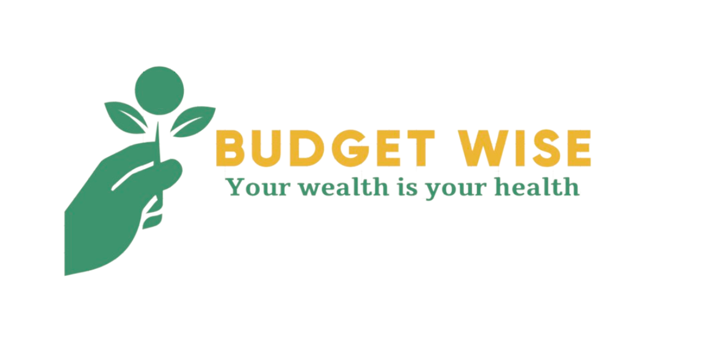

 

</h1>

# SUBMISSION
## 🚀 Deployment
#### _(please note, your team must also include the deployed links in the usual submission in Hackapp)_
The project is deployed and can be accessed at [http://your-deployed-link.com](http://your-deployed-link.com).

## ✔️ Criteria
In this section, we will briefly discuss how our team addressed the applicable criteria:

💡 The design provides the user with an easy to capture and track financial information. 

💡 Users can monitor and gain insights on how to reach their financial goals. 

💡 The project is responsive to mobile, tablet, laptop, and desktop screensizes.  

💡 The project is well-planned using GitHub Projects.

💡 The project has a well documented README based on the provided template.

# 📮 ABOUT SUBMISSION
## Intro
One or two paragraphs providing an overview of our project

## 🎯Project Goals
The overall objective is to provide a low-cost, fully accessible financial tracker and planner that helps users achieve their financial goals.

➡️ Problem Statement - As a user I want to be able to easily track my expenditure so that I can achieve my financial goals.

➡️ Objective(s) - The main objective is to provide a low-cost, responsive, fully-accessible financial tracker and planner.

➡️ Target Audience - The target audience are all users who want to track their progress toward their financial goals with smartphones, tablets, laptops, and desktops.

➡️ Benefits - Insights can be gained on spending habits and patterns. Monitoring progress toward reaching your financial goals is easy and accessible. 

While creating this project we were mindful to future-proof for scalibility.  Google sheets was initially used as a backend - this was chosen as it was felt that this app should really have a way of saving data so that a returning user can enter spending data, in particular, over a period of time.

One way (perhaps a final solution) would be to build this using Django frameworks which support full database and authentication functionality. To reduce deployment complexity, we opted for Google sheets. This has embarked us on a learning curve with Flask (used as the bridge between HTML and Python).

## Design
### Color Scheme

### Typography

## UX Design

### User Stories
**FTU**:
FTU01 As a **first-time user** I want to **quickly understand the site purpose** so I **can decide whether to spend time exploring and discovering the site**
FTU02 As a **first-time user** I want to **easily navigate the site** so I **don't become frustrated and leave**
FTU03 As a **first-time user** I want to **be able to navigate the site without mandatory login** so **I can discover site features before deciding whether to commit to using site**
FTU04 As a **first-time user** I want to **increase my financial awareness** to **improve my personal financial circumstances**
FTU05 As a **first-time user** I want to **access this site on a device of my choosing (mobile, tablet, laptop, desktop)** so that I can **access by a method and at a time that is convenient and accessible to me**

**Returning User:**
RU01 As  a **returning user** I want to **enter my financial goals** so I can **target what's important to me personally**
RU02 As a  **returning user** I want to **create a spending diary** so I can **track my spending over time**
RU03 As a **returning user** I want to **save data under my username** so I can **access my saved goals and spending history on subsequent site visits**
RU04 As a **returning user** I want to **set a monthly spending budget** so I **know what amount is available to me**
RU05 As a **returning user** I want to **see a breakdown of my spending by category** so I can **gain insights into my spending**
RU06 As a **returning user** I want to **see insights and trends of my spending** so I can **adjust my spending behaviour**
RU07 As a **returning user** I want to **track my progress against financial goals** so I can **adjust my spending behaviour if not meeting my goals**

System Owner: SO:
SO01 As **System Owner** I **want to provide a system that is easy to use** to **encourage users to visit and return to the site**
SO02 As **System Owner** I **want to provide responsive web pages** to **encourage users to use the site across multiple devices**
SO03 As **System Owner** I **want to provide interesting analysis and insights** to **increase user engagement with site**
SO04 As **System Owner** I want to **provide a low-cost website that can be implemented quickly** to **deliver this project**
SO05 
SO03 As **System Owner** I want to **provide informative content** to **increase user's financial literacy and awareness**
   

### Wireframes

#### Financial Goals Page

#### Spending Diary Page

#### Insights Page

#### About Page

#### Settings Page 

## Site Features
Site features(first draft):
F01 Site purpose is clearly identified and apparent a user who reaches the site
(Future. as in the very near future before we submit)
Information is organised logically, with goal-setting, spend tracking, budget monitoring and insight analysis.
There is an infomative 'About' page and an opportunity for the user to provide feedback, suggestions for future development, or issues withthe site.

This satisfies user required FTU01 - clear site purpose in order to decide to proceed.

** F02 Ease of navigation**
The overall site layout follows a show-hide system, so relevant sections of the site are visible to the user.
A navgation bar gives ease of movement between the various site functions.

At the bottom of each section there is a 'minimise' arrow to hide the relevant section and return to the navbar options.
This satisfies user requirements FTU02, FTU03, allowing the user, whether first-time or returning user to navigate smoothly within the site.

** F03 Responsivess **
The site was constructed on a mobile-first principle. Each section has been constructed to be responsive to the screen size of the device it is run on.
Responsive design principles such as using on-sceen buttons, pre-filled prompts and pop-ups rather than text-based entry, make the site good for small-screen usage.
<screenprint(s) of spending entry panel>

This satisfies first-time user requirements FTU05

** F04 Accessibility and Performance **
The site performs well and satisfies accessibiliyt guidenlines (CHECK)

** F05
F06
F07
F08
F09
F10

## 💻 Tech Stack
- CSS
- JavaScript
- Python
- Flask
- Google Sheets

## 🙌 Credits
The team consisted of: Kaylae Smith (scrum master), Deidre McCarthy, Nikola Simic and Caylin Dewey.

## 🌐 Media, Frameworks, Libraries & Programs Used

- [Git](https://git-scm.com/) - For version control.

- [GitHub](https://github.com/) - To save, store, and deploy files.  GitHub projects was used on a Kanban board to track tickets.

- [Google Cloud Console](https://console.cloud.google.com/) - An API was used to provide a database for this project.

- [Bootstrap](https://getbootstrap.com/) - For a CSS framework enabling responsive and mobile first websites.

- [Logo](http://brandcrowd.com/) - For the logo.

- [Coolers](http://coolers.com/) - The JanHack Color Scheme was used. 

- [Font](https://fontawesome.com/) - Was used to source the favicon.

- [Google Fonts](https://fonts.google.com/) - To import the fonts used on the website.

- [Balsamic](https://balsamiq.com/) - To create wireframes.

- [Google Dev Tools](https://developer.chrome.com/docs/devtools/) - To ensure responsiveness and styling.

- [Am I Responsive?](http://ami.responsivedesign.is/) - To display image on range of devices.

- [Shields.io](https://shields.io/) - To use badges for the README file

- [ChatGPT](https://chat.openai.com/) - To format and check code, spelling and grammar.

- [Emojipedia](https://emojipedia.org/) - To source emojis

